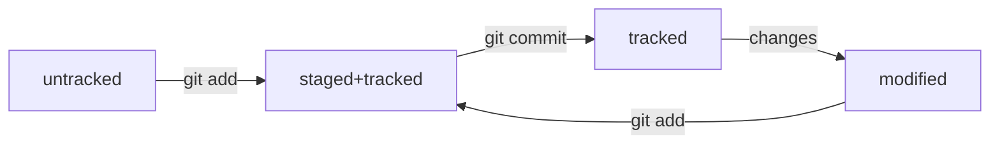

# Шпаргалка к обучению навыкам Git

----

## Что такое Git, отличие от GitHub
_Git_ - представляет собой __средство для хранения истории изменения файлов программы__. Например, когда вносятся правки, дополнения к уже написанной программе можно удобно обратиться к предыдущим версиям реализации. Одновременно с этим присутствует возможность отката к предыдущим рабочим версиям, если что-то пошло не так.
_GitHub_ (а также _GitLab_ и т.д.) - являются __сервисами, позволяющими командам управлять своим общим проектом на нескольких удаленных машинах__. Так, например, каждый из них может выполнить отправить свой коммит на код-ревью и получить фидбэк от своих коллег по возможности добавления наработок в ветку __master__.

----

## Ветки

_Ветки_ представляют собой струтуру изменений проекта, имеется основная ветка __master__ или __main__, которая является основной версией продукта, а также может быть неограниченное количество побочных веток, каждая из которых представляет собой ответвление процесса разработки внутри команды. Над такой веткой может работать, как один, так и несколько разработчиков параллельно.

## Основные команды работы в Git

1. Работы в директориях
- ```pwd``` - отображение папки, в которой находится юзер
- ls - отображение файлов в текущей папке
- ```ls -a``` скрытые файлы и папки, названия, которых начинаются с точки
- ```cd ..``` - перемещение выше на одну директорию
- ```cd ~``` - перемещение к корневой директории
- ```cd /Desktop``` - перемещение в директорию Desktop
- ```mkdir MyNewDir``` - создание директории MyNewDir
- ```touch test.txt``` - создание файла test.txt
- ```rmdir MyNewDir``` - удаление директории MyNewDir
- ```rm -r MyNewDir``` - удаление директории MyNewDir, а также всех вложенных файлов в директорию
- ```rm test.txt``` - удаление файла test.txt

2. Работа с контролем версий
_После внесения изменений в файлы необходимо добавить изменения в Git_

Для проверки наличия измененных файлов, готовых к процессу добавления в Git нужно ввести команду `git status`

- ```git add .``` - позволяет добавить к списку файлов для коммита все файлы из текущей директории
- ```git add all``` - функция аналогична предыдущей
- ```git add -test.txt``` - позволяет добавить к сцене (статус _staged_) файлов для коммита файл test.txt
- ```git commit -m "****"``` - позволяет добавленные в сцену файлы добавить в коммит, с учетом последних изменений, перед которыми были вызваны команды add
- ```git push origin master``` - позволяет добавить файлы в удаленный репозиторий, где origin -название удаленного сервера, master - название основной ветки или иной другой, куда выполняется пуш

----

## Статусы файлов

При работе с файлами с применением системы контроля версий Git в своем жизненном цикле они постоянно переходят из состояния в состояние. Такие состояния называются __статусами файла__.

Статус файла представляет собой отображение текущего состояния этого файла относительно предыдущего (HEAD) коммита. Всего существует 4 основных состояния файлов:
- _untracked_ - такое состояние означает, что данный файл был недавно создан, при этом ниразу еще не добавлялся на сцену.
- _tracked_ - такое состояние означает, что данный файл уже известен системе git и любые изменения и работа с ним уже отслеживаются системой контроля версий.
- _staged_ - данный тип не может быть независит от _tracked_, так как данный при попадании на сцену через команду ```git add``` автоматически попадает под контроль. Файлы, добавленные в сцену могут быть повторно модифицированы, для этого необходимо выполнить команду ```git restore --staged <file>```, где <file> - название файла, который необходимо убрать со сцены для дальнейшей доработки.
- _modified_ - аналогично _staged_ является зависим от статуса _tracked_, в данную категорию попадают все файлы, над которыми была проведена работа по изменению их состояния.

